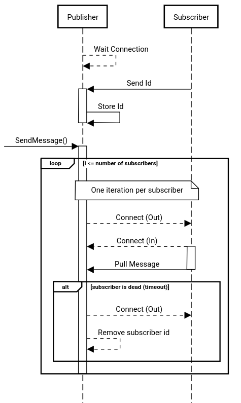
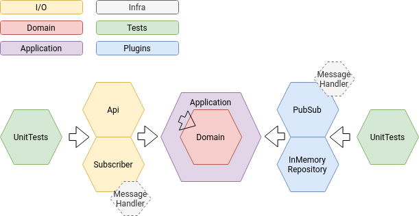

# C# Publish/Subscribe pattern + Api skeleton

This project creates a pub/sub mechanism using purelly C#.  
To demonstrate it working, it was created an Api that will be (through application -> pub/sub) the producer/publisher and a console application that will be the consumer/subscriber

## Pub/Sub implementation
To communicate across different processes I chosed to use named pipes, a special file used to send messages across different processes.

### Connection and communication scheme:


## Project overview
In this project, I created an API structure that allows to add/remove parts from the code with easy.  
For instance, we add or remove all pub/sub messages by just removing from the container registry, without having to change any code.  
Also, it is possible to redirect only a specific "get" to a different repository implementation to increase performance, such as the following examples:
- EF for commands, Dapper for Queries
- EF for everything, Dapper for special cases
- RDB for everything, Redis for special cases
- etc
This is possible due to the interface seggregation.  
Everything inside "Infra" folder can be a nuget package. The MessageHandler is a infra project.
### Solution structure

```
└──Infra
    └── MessageHandler
└── IO
    ├── Api
    └── Subscriber
└── Plugins
    ├── InMemoryRepository
    └── PubSub
├── Application
├── Domain
└── UnitTests
```
### Dependency map


## How to test
You can chose if you run first the Api and then the subscribers  
|| run the subscribers and then the Api  
|| run a subscriber, run the Api and run another subscriber

> As you can see you can start as meny instances of the subscriber as you wish.

It doesn't matter because the Message Handler has an autodiscovery mechanism.

* No need to run docker
* No database envolved (only a static list)
* The transformation is to json

## Used libs
* Polly: To add some policies (to speed me up)
* Mediatr: To handle the commands, queries and notifications
* xUnit: To test
* Moq : To mock
* FluentAssertions: Because I like it